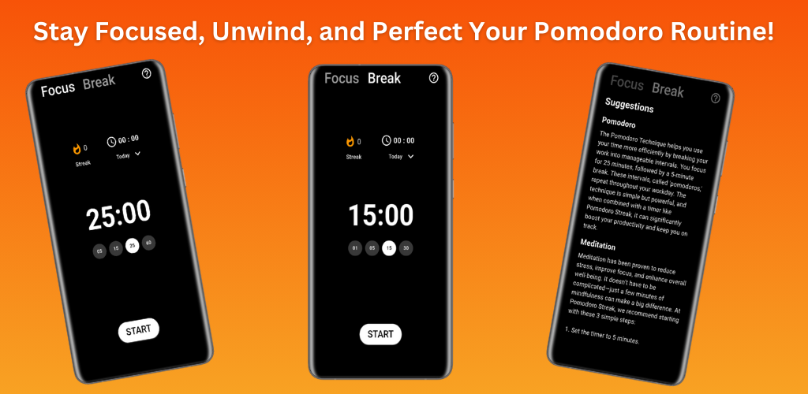
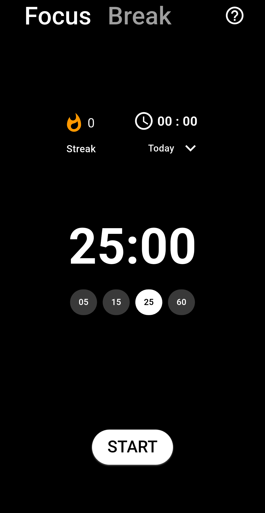
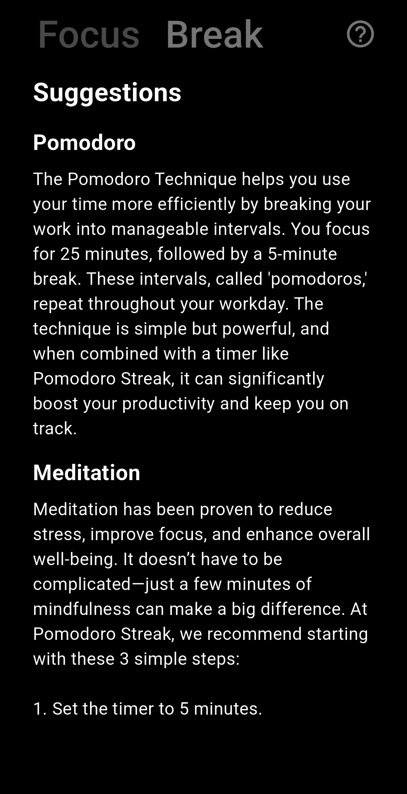
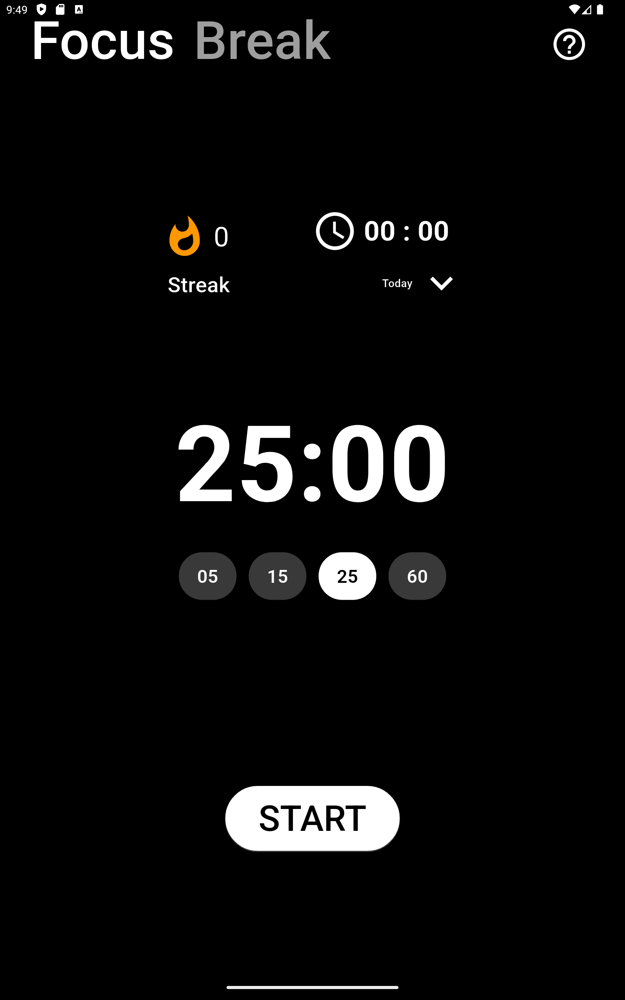
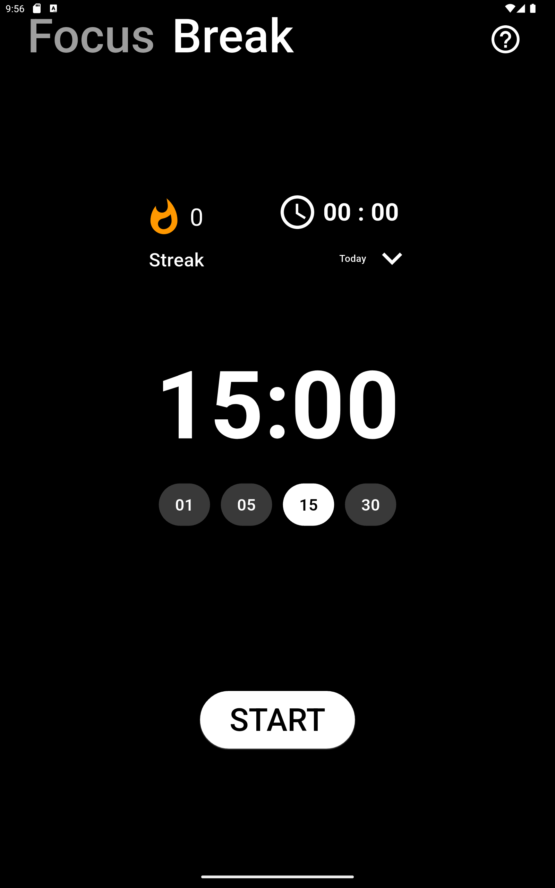
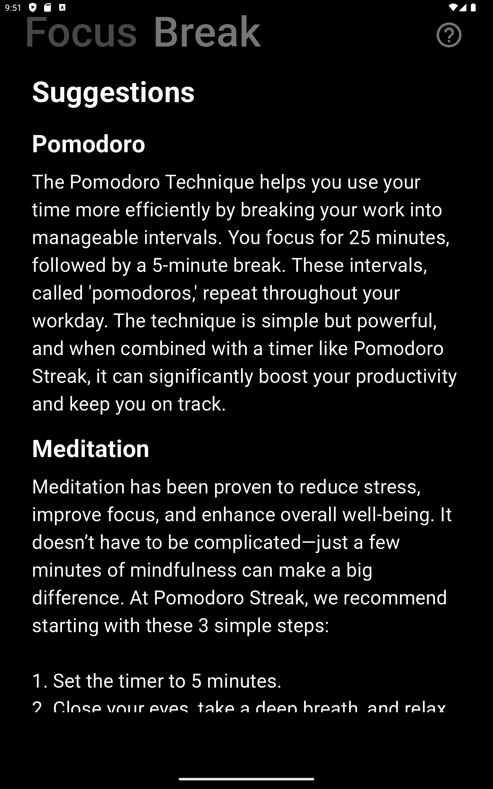

# Pomodoro_Streak App

## Description
**PomodoroStreak** is a time management app based on the **Pomodoro Technique**, designed to boost productivity by breaking work into **focused intervals** with **scheduled breaks**.  

## 📲 Download PomodoroStreak  
Experience **enhanced productivity** with PomodoroStreak! Get it now on the **Google Play Store**:

<a href="https://play.google.com/store/apps/details?id=com.yourapp.pomodorostreak">
  
</a>

- 📌 **Total Downloads:** 5+ 
- ⭐ **Average Rating:** N/A  

  

### **Or Scan the QR Code to Download**


## 🚀 Features  

- **Customizable Focus & Break Sessions** → Set custom session durations.  
- **Start, Pause, Resume & Reset Timer** → Control your session effortlessly.  
- **Track Cycles & Streaks** → Monitor your productivity over time.  
- **Local Storage with SQLite** → Saves session history & streaks.  
- **Dynamic Bottom Sheet** → Select **Today, This Week, etc.** for insights.  
- **Live Notifications** → Get **alerts** when a session completes.  
- **Dark Theme Support** → Minimalist **dark mode** for better visuals.  
- **Tablet Support** → Optimized layout for larger screens.  
- **Haptic Feedback** → Subtle vibrations for important actions.  


## 📱 Screenshots  

### 📲 **Mobile Version**  
<p align="center">
    
    
    
</p>  

### 💻 **Tablet Version**  
<p align="center">
    
    
    
</p>  


## Installation
1. Clone the repository:
   ```bash
   git clone https://github.com/your-username/pomodoro-timer.git
   ```
2. Navigate to the project directory:
   ```bash
   cd pomodoro-streak
   ```
3. Install dependencies:
   ```bash
   flutter pub get
   ```
4. Run the app:
   ```bash
   flutter run
   ```

### 💡 Usage Guide
```bash
🎯 Start a Focus Session → Tap the Start Button under Focus Mode.
☕ Switch to Break Mode → Tap the Break Mode tab.
📊 View Session Statistics → Open the Bottom Sheet to select Today, This Week, etc.
```


### 📦 Dependencies

The following Flutter packages power PomodoroStreak:

| Package                        | Purpose                                 |
|--------------------------------|-----------------------------------------|
| `cupertino_icons`             | iOS-style icons                         |
| `flutter_riverpod`            | State Management                        |
| `sqflite`                      | Local database management               |
| `path`                         | File system path handling               |
| `intl`                         | Date & time formatting                  |
| `flutter_local_notifications`  | Local notifications                     |
| `permission_handler`           | Permission management                   |


### Installing Dependencies

Run the following command to install the dependencies:

```bash
flutter pub get
```


### 🚀 Future Enhancements

✅ Below are some exciting features planned for upcoming versions of PomodoroStreak:

- 📱 Screen Always On → Prevent screen from locking while timer runs.
- 🔔 Custom Timer Completion Sounds → Allow users to select different alert tones.
- 🌗 Dark/Light Mode Toggle → Add a theme switch for UI customization.
- 🎉 Celebratory Animations → Show glitter or flashing background on completion.
- ⏳ Final 10-Second Effect → Timer pulses, changes colors, and animates.
- 🏆 Streak Achievement Card → Show motivational messages on long streaks.
- 🔔 Daily Reminder Notifications → Remind users to stay productive.
- 📢 Beep Sound on Start → Indicate that the timer has started.
- ⭐ In-App Review Prompt → Ask users for feedback after frequent usage.
- ℹ️ App Version & Build Info → Display app version at the bottom.


### 🔧 Planned Fixes & Improvements

✅ Below are some improvements & bug fixes planned for the next update:

- 🔄 Move Reset Button → Relocate below the Start button for easier access.
- 📅 Fix Weekly, Monthly, All-Time Display Issue → Ensure "This Week", "This Month", "All Time" fits in one line when selected from dropdown.
- ⏯ Pause & Resume in Notifications → Add pause/resume buttons.
- 📌 Improve Dropdown Filters → Remove gaps to show all options at once.
- ⏳ Enhance Timer UI → Make animations smoother & interactive.
- 💡 Daily Motivation Quote → Show an inspiring quote at the top.  


