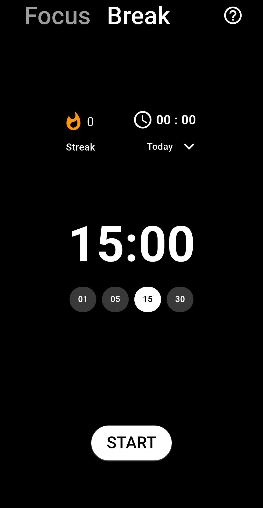
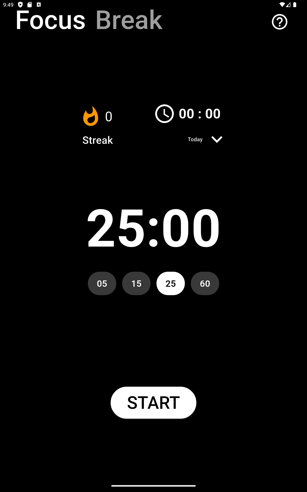
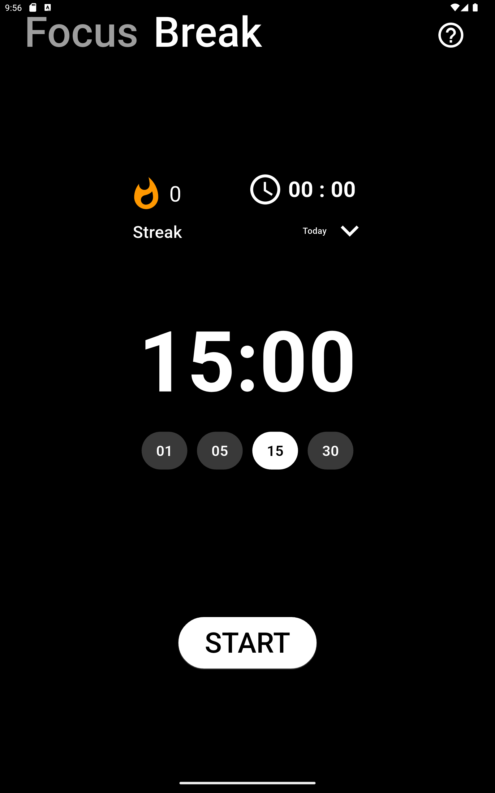
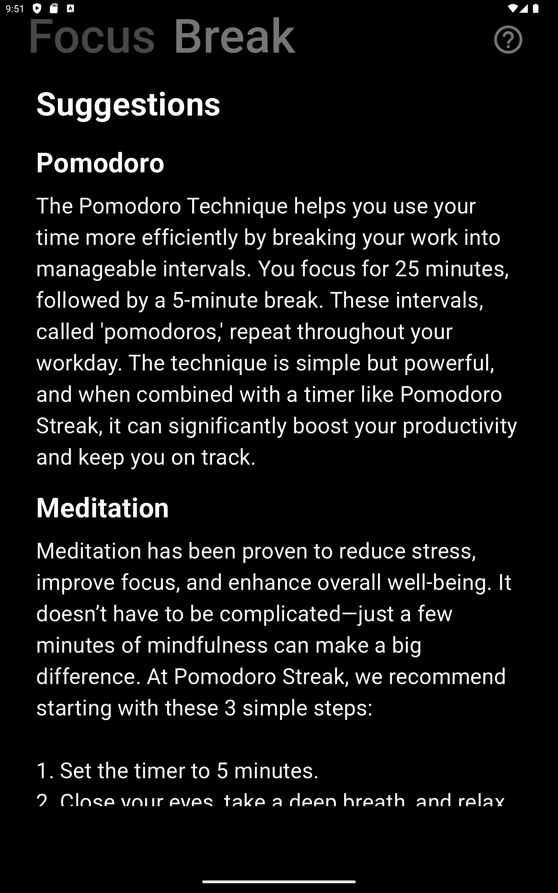

# Pomodoro_Streak App

## Description

## Features
- Focus and break sessions with customizable durations.
- Start, Pause, and Resume timer functionality.
- Tracks cycles and time spent on tasks to build streak.
- Stores session data in a local database (SQLite).
- Custom Bottom sheet for selecting timeline options (Today, This Week, etc.).
- Notifications after each session is completed.
- Responsive UI with a clean and intuitive design.
- Minimalistic Dark Theme
- Information about the Pomodoro Technique.

## Mobile Screenshots




## Tablet Screenshots




## Installation
1. Clone the repository:
   ```bash
   git clone https://github.com/your-username/pomodoro-timer.git
   ```
2. Navigate to the project directory:
   ```bash
   cd pomodoro-timer
   ```
3. Install dependencies:
   ```bash
   flutter pub get
   ```
4. Run the app:
   ```bash
   flutter run
   ```

---

### **Usage**
```markdown
## Usage
- Start a focus session by tapping the **Focus Mode** Start Button in the Bottom.
- Switch to a break session using the **Break Mode** tab.
- View session statistics by selecting a timeline in the bottom sheet.

## Dependencies

The following dependencies are used in this project:

1. **[cupertino_icons: ^1.0.8](https://pub.dev/packages/cupertino_icons)**
   - Provides iOS-style icons for use in Flutter applications.

2. **[flutter_riverpod: ^2.6.1](https://pub.dev/packages/flutter_riverpod)**
   - A state management library that simplifies and enhances state management in Flutter apps.

3. **[sqflite: ^2.4.1](https://pub.dev/packages/sqflite)**
   - A plugin for SQLite database management in Flutter applications.

4. **[path: ^1.9.0](https://pub.dev/packages/path)**
   - A library for manipulating file system paths across platforms.

5. **[intl: ^0.20.1](https://pub.dev/packages/intl)**
   - Provides internationalization and localization utilities, including date formatting.

6. **[flutter_local_notifications: ^18.0.1](https://pub.dev/packages/flutter_local_notifications)**
   - A plugin for displaying local notifications on Android and iOS.

7. **[permission_handler: ^11.3.1](https://pub.dev/packages/permission_handler)**
   - A plugin for checking and requesting permissions across platforms.

---

### Installing Dependencies

Run the following command to install the dependencies:

```bash
flutter pub get


## Features to be added in future versions
- [ ] Tablet device support
- [ ] Screen Always on while Timer is Running
- [ ] Display Pomodoro remaining Timer on LockScreen While Running
- [ ] different sounds to select from to play after Timer duration Completes
- [ ] haptics on start, pause, stop, focus, break, information buttons
- [ ] dark and light theme button to toggle
- [ ] add some glitter or crackers effect to it after the timer finishes or   background screen should blink with diff colours 
- [ ] when timer reaches 10 sec it should pop with diff colours and change big small
- [ ] a small card to flex your productivity when you created a good streak
- [ ] daily reminder to use pomodoro timer
- [ ] when user taps on start button a beep sound should be played to indicate that the timer is running
- [ ] show in_app_review popup when user use app for sometime use some launch times to display the review popup after a week or so
- [ ] add app version and build number in the bottom of the app to let user know which version they are on.

