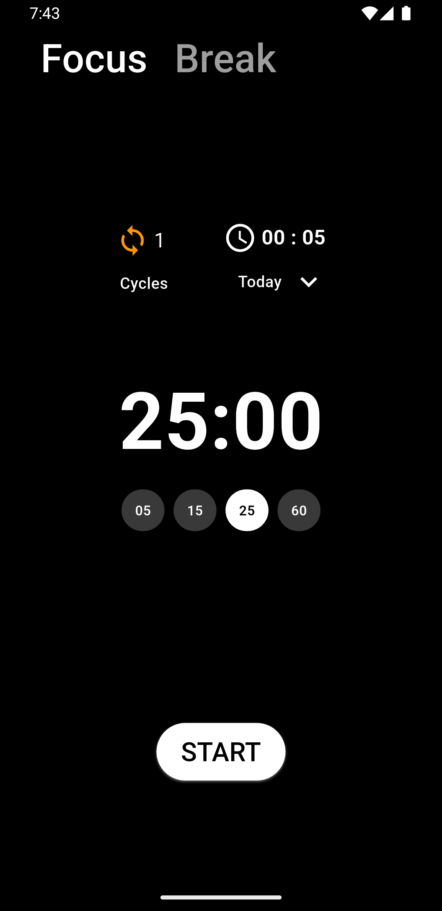
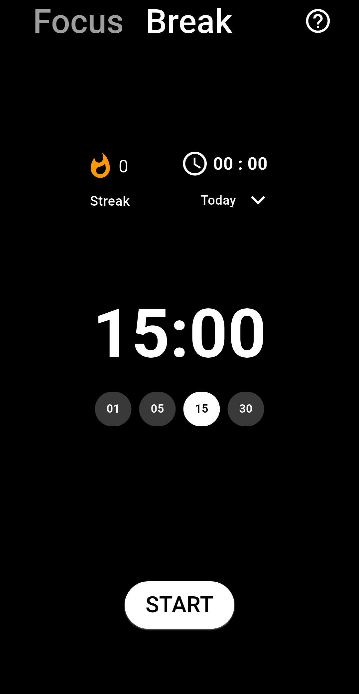

# Pomodoro_Streak App

## Description

## Features
- Focus and break sessions with customizable durations.
- Tracks cycles and time spent on tasks to build streak.
- Stores session data in a local database (SQLite).
- Custom Bottom sheet for selecting timeline options (Today, This Week, etc.).
- Responsive UI with a clean and intuitive design.
- Minimalistic Dark Theme

## Screenshots



## Installation
1. Clone the repository:
   ```bash
   git clone https://github.com/your-username/pomodoro-timer.git
   ```
2. Navigate to the project directory:
   ```bash
   cd pomodoro-timer
   ```
3. Install dependencies:
   ```bash
   flutter pub get
   ```
4. Run the app:
   ```bash
   flutter run
   ```

---

### **Usage**
```markdown
## Usage
- Start a focus session by tapping the **Focus Mode** Start Button in the Bottom.
- Switch to a break session using the **Break Mode** tab.
- View session statistics by selecting a timeline in the bottom sheet.

## Features to be added in future versions

- [ ] Screen Always on while Timer is Running
- [ ] Display Pomodoro remaining Timer on LockScreen While Running
- [ ] different sounds to select from to play after Timer session Completes